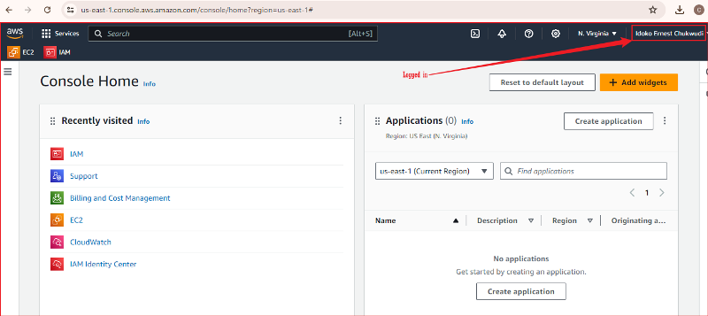
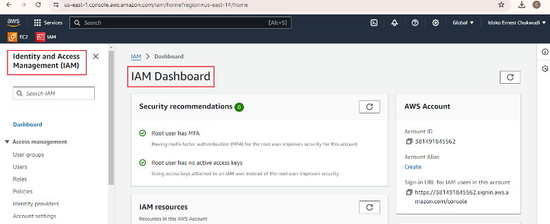
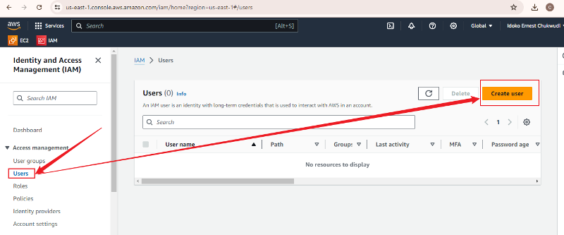
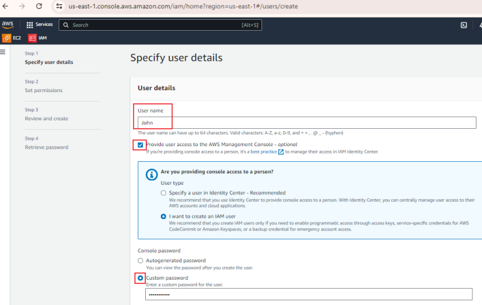

### Mini-Project: Managing IAM Users and Groups on AWS Management Console

This project aims to demonstrate my proficiency in creating and managing IAM (Identity and Access Management) users and groups on AWS using the AWS Management Console. Throughout the project, I will guide you through the process of setting up IAM users, creating groups, assigning specific IAM View Only permissions, and testing those assigned permissions.

### Objectives:
**1. Create IAM Users:** Create individual IAM Users with unique access credentials.

**2. Create IAM Groups:** Showcase the concept of IAM groups and how to organize users within them.

**3. Assign IAM View Only Permissions:** Show my experience in assigning a custom IAM policy granting View Only permissions.

**4. Test Assigned Permissions:** Verify that the assigned IAM View Only permission work as expected.

### Project Tasks:
### Task 1: Create IAM Users

**1. Log into the AWS Management Console**

**2. Navigate to the IAM service.**

**3. Click on `Users` in the left navigation pane and Click the `Create user` button**

**Fill the details for the new IAM user, including access type and permissions.**

### Task 2: Create IAM Groups
**1. In the IAM dashboard, Click on `User Groups` in the left navigation pane and Click on Groups**

**2. Provide a name for the group and attach policies to define group permissions and add IAM user to the group**

### Task 3: Assign IAM View Only Permissions
**1. Navigate to the IAM dashboard and select `Policies` in the left navigation pane and click `Create policy`.**

**2. Create a custom policy named `IAM_View_Only` with permission limited to read-only actions.**

**3. Attach the `IAM_View_Only`** policy to an IAM user created in Task 1.**

### Task 4: Test Assgned IAM View Only Permission
**1. Log in to the AWS Management Console using the IAM user created in Task 2. Attempt various actions (e.g. Listing resources, viewing configurations) to test the assigned View Only Permissions.**

- View Resources on S3

- Denied attempt on trying to create S3

- View Configuration on EC2 Security Groups tab

- Denied attempt on trying to launch EC2 instance

### Conclusion
In this project, I successfully demonstrated my proficiency in creating and managing IAM (Identity and Access Management) users and groups on AWS using the AWS Management Console. The project involved setting up IAM users, creating groups, assigning custom IAM View Only permissions, and testing these permissions.

Through the completion of each task, I showcased the ability to:

1. Create IAM users with unique access credentials.
2. Organize users within IAM groups and define their permissions.
3. Assign a custom IAM policy to grant View Only permissions.
4. Verify the effectiveness of the assigned permissions by testing access controls and ensuring that the permissions work as expected.